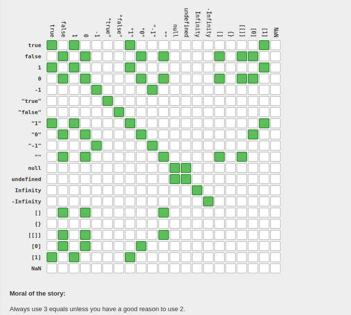

# AM BACK IN THAT MODE AGAIN ...

## Comparision in JavaScript

1 ) To identify equality operators and compare numbers with relational operators .

2 ) The four main example of equality operators are :

    -strict equality operator ( === ):returns true if both the value and data type are the same 
    -loose equality operator ( == )
    -strict inequality operator ( !== )
    -loose inequality operator ( != )

3 ) What is the main difference between strict and loose equality operators .

### STRICT EQUALITY AND INEQUALITY OPERATOR .{Line 1-14}

- What is TYPE CONVERSION ? and how it relates to strict equality operators .
- Strict Equality Operator ( === ) does not perform type conversion and only return true if both the value and data type are the same .
- Strict Inequality Operator (!==)will only return TRUE if the value and data type are not the same .
  
### LOOSE EQUALITY AND INEQUALITY OPERATOR .{14-28} [https://dorey.github.io/JavaScript-Equality-Table/]

- What is TYPE CONVERSION ? and how it relates to loose equality operators .
- Loose equality operator (==) returns true if the value are equal or if it can perform a type conversion .
- Loose inequality operator (!=) will return true if the value are not equal or if it can perform a type conversion or is the exact opposite LEO .    
- This explains alot about the type conversions ..
-    

## COMPARE NUMBERS WITH RELATIONAL OPERATORS .{30-35}
1 ) We have a total of 4 relational in javascript ..i.e
   
   a) Greater than ( > )

   b) Less than ( < )

   c) Greater than or equal to ( >= )

   d) Less than or equal to ( <= )

NB : Type conversion when comparing non-numbers to numbers 
   -when comparing a string with a number but the string ought to contain a value of a number .{36-39}

   ## DONT DITTIRE ... !

   # JS CONDITIONALS
   
   1 ) if... else this is a condition which may execute either truthy or falsy values .
    -Resource : https://developer.mozilla.org/en-US/docs/Web/JavaScript/Reference/Statements/if...else

    - Example 
               if you want to make it you have to work for it 
                  else if  you dont want  to make it be lazy 
               
               if you are hungry eat something 
                  else if you are not hungry dont eat anything .
      
      NB: In writing code we use the same logic thus for a certain action to take place a specific condition must be met thus (control flow) .

    - Meaning of the word JS expression : this is anything which returns a value  ie.[line of code 42- 48]
    - Meaning of the word block statements : rep with { "point in which we place javascript statemnets "}[line of code 50 -54] 

NB:Top platform to find a job use indeed
SWEFCLb6FHs5Xhk